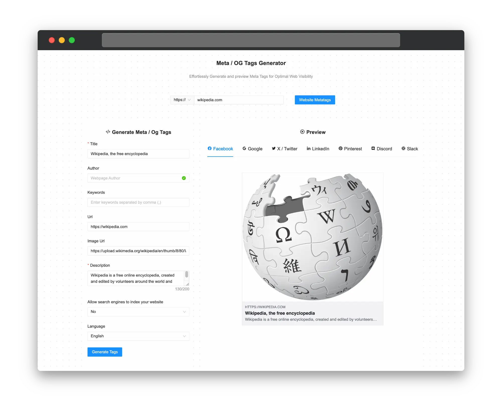
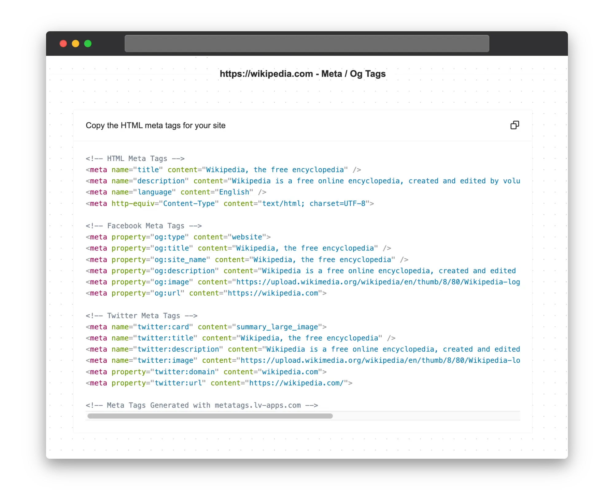

# Meta/OG Tags Generator

  

This is an Angular application that allows users to generate meta and Open Graph (OG) tags for their webpages. These tags are essential for improving website visibility and search engine optimization (SEO), as well as enhancing the appearance of links shared on social media platforms.

  

## Features

- Built with `Angular`, `TailwindCss`, `AntDesign`, `Prismjs`, and `Jest`
- Generate meta tags, including `title`, `author`, `description`, `keywords`, and `language`
- Generate OG tags for Facebook, including `og:type`, `og:title`, `og:site_name`, `og:description`, `og:image`, and `og:url`
- Generate Twitter cards, including `twitter:card`, `twitter:title`, `twitter:description`, `twitter:image`, `twitter:domain`, and `twitter:url`
- Live preview of how the webpage will appear on different platforms
- Copy the generated HTML code for easy integration into your website

## Getting Started

To get started with the Meta/OG Tags Generator, follow these steps:

1. Clone the repository: `git clone https://github.com/your-username/meta-og-tags-generator.git`
2. Install the required dependencies: `npm install`
3. Start the development server: `npm run start`
4. Open your web browser and navigate to `http://localhost:4200`

## Usage

1. Enter the URL of your website in the provided input field.
2. Fill in the required fields for the meta tags, such as `Title`, `Author`, `Keywords`, `Description`, etc.
3. Select the desired social media platforms for which you want to generate OG tags (e.g., Facebook, Twitter, LinkedIn).
4. Click the "Generate Tags" button to generate the meta and OG tags.
5. The generated HTML code will be displayed, which you can copy and paste into your website's HTML file.
6. Use the live preview section to see how your webpage will appear on different platforms.

## Contributing

Contributions are welcome! If you find any issues or have suggestions for improvements, please open an issue or submit a pull request.

## License

This project is licensed under the [MIT License](LICENSE).

## Acknowledgments

- [Angular](https://angular.io/) - The web framework used for building this application.
- [AntDesign](https://ng.ant.design/) - An enterprise-class Angular UI component library based on Ant Design, all components are open source and free to use under MIT license.
- [BoxIcons](https://boxicons.com/) - Simple Open Source icons carefully crafted for designers & developers
- [Meta Tags](https://developers.facebook.com/docs/sharing/webmasters/), [Open Graph](https://ogp.me/), and [Twitter Cards](https://developer.twitter.com/en/docs/twitter-for-websites/cards/overview/abouts-cards) - The standards and guidelines followed for generating the meta and OG tags.

This project was generated with [Angular CLI](https://github.com/angular/angular-cli) version 15.2.10.
